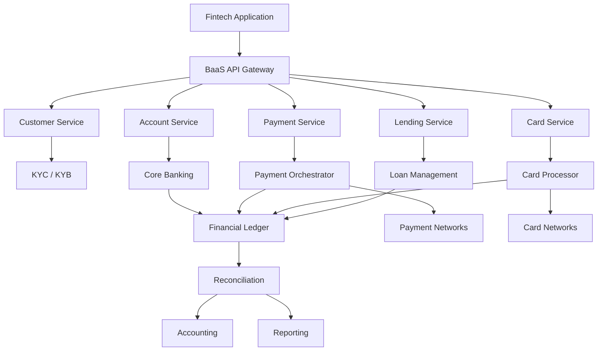
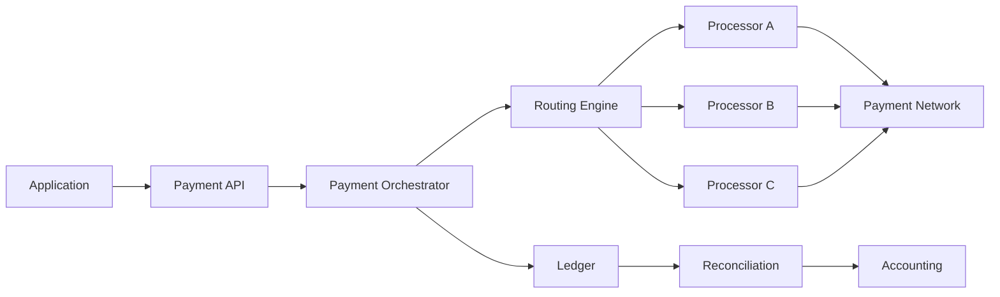
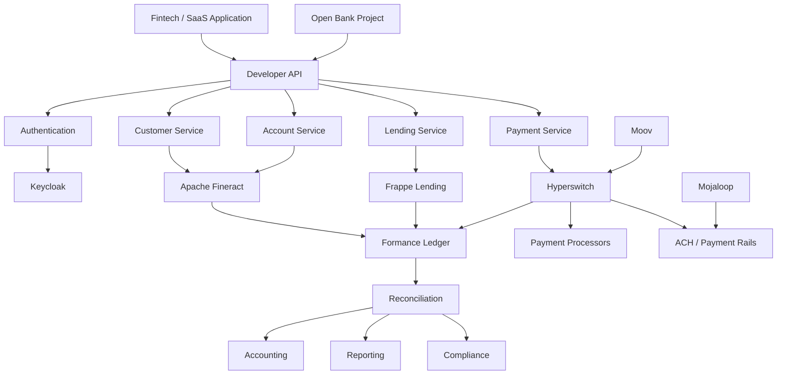
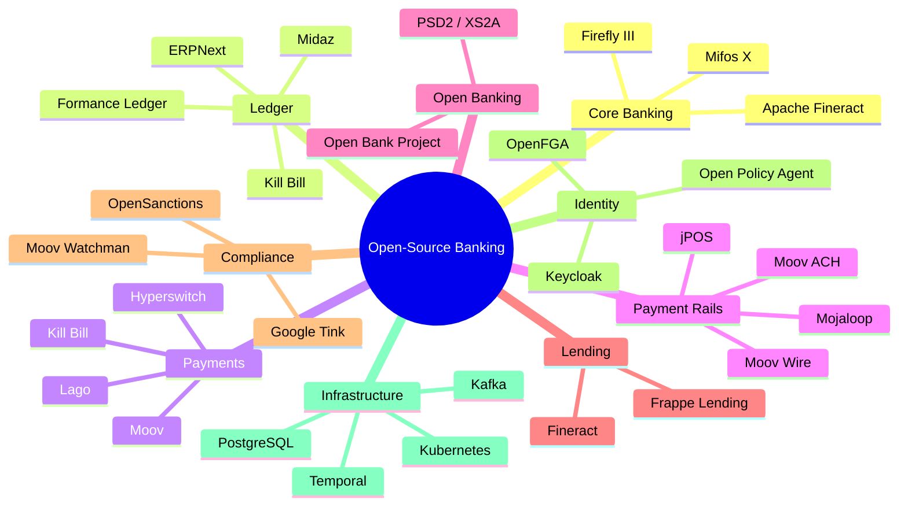

# 🏦 Awesome API Banking Platform

<p align="center">
  <a href="https://github.com/ishandutta2007/Awesome-API-Banking-Platform">
    
  </a>
</p>

<p align="center">
  <a href="https://github.com/ishandutta2007/Awesome-Awesome-Awesome"></a><a href="https://discord.gg/jc4xtF58Ve"></a>
  <a href="https://github.com/ishandutta2007/Awesome-API-Banking-Platform/stargazers"></a>
  <a href="https://github.com/ishandutta2007/Awesome-API-Banking-Platform/network/members"></a>
  <a href="https://github.com/ishandutta2007/Awesome-API-Banking-Platform/issues"></a>
  <a href="https://github.com/ishandutta2007/Awesome-API-Banking-Platform/pulls"></a>
  <a href="LICENSE"></a>
  <a href="https://github.com/ishandutta2007"></a>
</p>

---

# 🏦 Top Banking-as-a-Service (BaaS) APIs & Open-Source Banking Infrastructure

> 🌟 A definitive, production-grade curated list of **Banking-as-a-Service (BaaS) platforms, embedded banking APIs, core banking platforms, payment orchestration infrastructure, programmable financial ledgers, and open-source software** for building modern fintech apps, neobanks, digital wallets, and autonomous money applications.

---

### 🔍 Overview & Capabilities

Modern Banking APIs empower software companies, platforms, and fintechs to embed regulated financial capabilities directly into customer workflows:

* 🏛️ **Accounts & Deposits:** Demand deposit accounts (DDA), virtual accounts, sub-ledgers, multi-currency wallets, FBO (For Benefit Of) structures.
* ⚖️ **Immutable Ledgering:** Programmable double-entry bookkeeping, audit trails, balance invariants, and real-time transaction graphs.
* ⚡ **Payment Rails:** Direct clearing connectivity across ACH (Next-day & Same-day), RTP (The Clearing House), FedNow (Federal Reserve), Fedwire, SEPA, Faster Payments (FPS), and BACS.
* 💳 **Card Issuing & Processing:** Virtual & physical card issuance, BIN sponsorship, dynamic spend controls, real-time authorization webhooks, and Apple/Google Pay push provisioning.
* 💸 **Money Movement & Payouts:** Multi-rail routing, payment orchestration, smart failovers, batch disbursements, and automated sweeping.
* 📊 **Lending & Credit:** Loan origination systems (LOS), loan management systems (LMS), interest amortization engines, credit scoring, and BNPL workflows.
* 🛡️ **Identity, KYC & KYB:** Automated identity verification, business corporate registry checks, beneficial ownership validation, and synthetic identity prevention.
* 🚨 **Compliance & AML:** Real-time transaction monitoring, OFAC/sanctions screening, PEP (Politically Exposed Persons) checks, SAR (Suspicious Activity Report) automation, and fraud scoring.
* 🧾 **Automated Reconciliation:** Bank statement file ingestion (BAI2, CAMT.053, MT940), automated transaction matching, discrepancy resolution, and GL integration.
* 🌐 **Open Banking & Data Aggregation:** Standardized REST APIs, ISO 20022 messaging, PSD2 / Open Banking UK compliance, and OAuth2 security profiles.

---

### 🧩 Commercial BaaS vs. Open-Source Self-Hosted Infrastructure

This repository benchmarks commercial BaaS platforms against **modular, self-hostable open-source components**.

> ⚠️ **Critical Regulatory Distinction**: There is no single open-source repository that provides banking charters, FDIC deposit insurance, direct clearinghouse membership, or regulated payment network BINs. Instead, modern engineering teams assemble an **open-source BaaS stack** to retain complete source code ownership, zero vendor lock-in, and custom ledger flexibility, while pairing with sponsor banks or clearing partners for regulated settlement:

```text
┌─────────────────────────────────────────────────────────────┐
│                    Fintech Application                      │
└──────────────────────────────┬──────────────────────────────┘
                               │
┌──────────────────────────────▼──────────────────────────────┐
│          Developer API Layer & Authentication (Kong/Keycloak)│
└──────────────────────────────┬──────────────────────────────┘
                               │
       ┌───────────────────────┼───────────────────────┐
       ▼                       ▼                       ▼
 🏦 Core Banking         💰 Ledger Engine        💳 Payments & Rails
 (Apache Fineract)       (Formance / Midaz)      (Hyperswitch / Moov)
       │                       │                       │
       └───────────────────────┼───────────────────────┘
                               │
┌──────────────────────────────▼──────────────────────────────┐
│           Reconciliation, Compliance & Reporting            │
│          (OpenSanctions • OBP • ERPNext • PostgreSQL)        │
└─────────────────────────────────────────────────────────────┘
```

---

## 📑 Table of Contents

* [☁️ SaaS & Hosted Platforms](#️-saashosted-platforms)
* [🌍 Open-Source Infrastructure](#-open-source)
* [🏦 Open-Source Core Banking](#-open-source-core-banking)
* [💰 Open-Source Financial Ledgers](#-open-source-financial-ledgers)
* [💳 Open-Source Payments Infrastructure](#-open-source-payments-infrastructure)
* [🌐 Open Banking APIs](#-open-banking-apis)
* [💸 Open-Source Payment Rails & Messaging](#-open-source-payment-rails--messaging)
* [💳 Open-Source Card & Payment Infrastructure](#-open-source-card--payment-infrastructure)
* [🏦 Open-Source Lending](#-open-source-lending)
* [🧾 Open-Source Accounting & Reconciliation](#-open-source-accounting--reconciliation)
* [🔐 Open-Source KYC, KYB & Compliance](#-open-source-kyc-kyb--compliance)
* [⚙️ Open-Source Fintech Infrastructure Directory](#️-open-source-fintech-infrastructure)
* [🧩 Commercial Platform → Open-Source Equivalent](#-commercial-platform--open-source-equivalent)
* [🏗️ Banking-as-a-Service Architecture](#️-banking-as-a-service-architecture)
* [🔄 Open-Source BaaS Architecture](#-open-source-baas-architecture)
* [💳 Open-Source Payments Architecture](#-open-source-payments-architecture)
* [⚖️ Commercial vs Open-Source](#️-commercial-vs-open-source)
* [📊 Banking Infrastructure Comparison](#-banking-infrastructure-comparison)
* [🎯 Recommended Projects by Use Case](#-recommended-projects-by-use-case)
* [🏢 Building a Treasury Prime Alternative](#-building-a-treasury-prime-alternative)
* [🏦 Building an Open-Source BaaS](#-building-an-open-source-baas)
* [🌐 Open-Source Banking Landscape](#-open-source-banking-landscape)
* [🧠 Why Open-Source Banking Infrastructure Matters](#-why-open-source-banking-infrastructure-matters)
* [⭐ Star History](#-star-history)
* [🤝 Contributing](#-contributing)
* [⚠️ Disclaimer](#️-disclaimer)

---

# ☁️ SaaS/Hosted Platforms

> 📊 **Industry Market Size & Fragmentation**: The global Banking-as-a-Service (BaaS) and embedded finance market was valued at **$21.5 Billion in 2024** and is projected to surpass **$78.5 Billion by 2032**, expanding at a robust **17.5% CAGR**. The sector is **moderately to highly fragmented** rather than a winner-take-all landscape. Because banking infrastructure is governed by sovereign bank charters, regional regulatory authorities (OCC/FDIC in the US, PRA/FCA in the UK, BaFin/ECB in Europe, RBI in India), and localized clearing rails (FedNow/ACH, SEPA/FPS, UPI, Pix), regional specialization and partner bank alignments prevent global monopolization.

Commercial BaaS platforms provide turnkey APIs on top of regulated bank partnerships, payment clearing networks, and compliance operations. The table below is **sorted in descending order by company scale (market valuation / revenue)**:

| Platform | Company | Market Valuation / Revenue | Primary Focus | Key Capabilities | Starting Pricing | Free Tier / Trial Limits |
| :--- | :--- | :--- | :--- | :--- | :--- | :--- |
| [Stripe Treasury](https://stripe.com/treasury) | Stripe | **~$70 Billion Valuation** (~$14B+ Net Revenue) | Financial accounts | Accounts, money movement and embedded finance | $0/mo account fee; Outbound ACH: $0.25/tx; Inbound ACH debit: $0.25/tx; Domestic Wire: $8.00/tx; Check deposit: $1.50/check | Free Developer Test Mode with no expiration; unlimited test accounts, simulated bank transfers, instant balance test adjustments, and test webhooks |
| [Stripe Issuing](https://stripe.com/issuing) | Stripe | **~$70 Billion Valuation** (~$14B+ Net Revenue) | Card issuing | Virtual and physical cards | $0.10 per virtual card; $3.00 per physical card; 0.2% + $0.20 per transaction (waived on first $500,000 in spend volume); $0 monthly fee | 100% fee-free transactions on first $500,000 in card spend; free Developer Test Mode with no expiration for unlimited virtual card testing |
| [Adyen Issuing](https://www.adyen.com/) | Adyen | **~$45 Billion Market Cap** (~€2B Net Revenue) | Embedded payments | Payments, issuing and financial products | $0 setup fee, $0 monthly platform fee; €0.11 ($0.13) fixed processing fee + Interchange++ / payment method fee per transaction (~$120/mo invoice minimum) | Free Developer Test Account with no expiration; unlimited test card issuing, mock authorisations, test API credentials, and simulated webhook events |
| [Galileo](https://www.galileo-ft.com/) | Galileo (SoFi) | **~$10 Billion Parent Cap** ($1.2B Acquisition) | Financial API infrastructure | Accounts, cards and payments | Starts at ~$3,000 – $5,000/mo base platform fee + setup fee + $0.15–$0.30/active account/mo and ~$0.05–$0.10 per transaction | Free Developer Sandbox with no expiration; simulated card issuing, account authorization endpoints, and mock transaction simulators |
| [Marqeta](https://www.marqeta.com/) | Marqeta | **~$2.5 Billion Market Cap** (~$700M+ Revenue) | Card issuing | Card issuing and payment infrastructure | Starts at ~$2,500 – $5,000/mo minimum platform commitment + ~$0.10–$0.25 per virtual card, ~$2.00–$3.50 per physical card; interchange revenue share | Free Developer Sandbox with no expiration; instant self-service API keys, test card issuing simulator, simulated funding accounts, and webhook test tools |
| [Solaris](https://www.solarisgroup.com/) | Solaris | **~$1.6 Billion (€1.4B) Valuation** (~€130M Revenue) | BaaS | Banking, payments, cards and embedded financial products | Starts at ~€3,000 – €5,000/mo platform minimum fee + ~€20,000 onboarding fee + €0.50–€1.00/mo per active account + €0.10–€0.25 per SEPA transaction | Free Developer Sandbox (Solaris Testing Environment) with no expiration; mock IBAN accounts, simulated SEPA clearing, and test card authorization |
| [Unit](https://www.unit.co/) | Unit | **~$1.2 Billion Valuation** (Fintech Unicorn) | Embedded banking | Accounts, cards, payments, lending and compliance infrastructure | Starts at ~$2,500 – $3,500/mo base platform fee (startup tier) + ~$0.20–$0.50/ACH, $10/wire, $0.10/virtual card; interchange revenue share | Free Developer Sandbox with no expiration; full replica of production environment with unlimited simulated payments, test accounts, and webhooks |
| [ClearBank](https://clear.bank/) | ClearBank | **~$1.0 Billion (£800M+) Valuation** (~£110M+ Revenue) | Banking infrastructure | Accounts, payments, clearing and banking connectivity | Starts at ~£2,500 – £5,000/mo minimum spend + ~£10,000 onboarding fee; Faster Payments: £0.05–£0.15/tx; BACS: £0.02–£0.05/tx; CHAPS: £5.00/tx | Free Developer Portal & Simulation Sandbox with no expiration; simulated UK clearing rails (FPS, BACS, CHAPS), test virtual accounts, and webhook simulators |
| [Unit21](https://www.unit21.ai/) | Unit21 | **~$500 Million Valuation** ($90M+ Raised) | Financial infrastructure | Compliance, fraud and financial-crime operations | Starts at ~$33,000/year (~$2,750/mo) entry contract (average ~$160,000/year based on alert volume, rule executions, and tracked entities) | 14 to 30-day proof-of-concept sandbox trial upon sales qualification; includes test rule engine tuning and synthetic transaction monitoring |
| [Treasury Prime](https://www.treasuryprime.com/) | Treasury Prime | **~$350 Million Valuation** ($75M+ Raised) | Banking-as-a-Service | Accounts, cards, payments, ledgering and embedded banking | Starts at ~$2,000 – $3,000/mo platform fee + per-account ($0.25–$1.00/mo), ACH ($0.15–$0.50/tx), Wire ($10–$15/tx); retains 50%–90% interchange | Free Developer Sandbox with no expiration; unlimited test bank accounts, simulated ACH/wire transfers, and test card creation ($0 test mode) |
| [Moov](https://moov.io/) | Moov | **~$250 Million Valuation** ($80M+ Raised) | Payments / embedded finance | ACH, RTP, FedNow, cards, payments and money movement | Starts at $500/mo minimum spend; Card processing: Interchange + 0.60% + $0.15; ACH: $0.25–$0.40/tx; Instant payments (RTP/Push-to-card): 0.95% (min $0.50, cap $5.00); Active wallet: $0.50/mo | Free Developer Sandbox with no expiration; full API access, simulated ACH/FedNow/RTP/card rails, and test-mode dashboard with $0 charges |
| [Synctera](https://www.synctera.com/) | Synctera | **~$200 Million Valuation** ($60M+ Raised) | BaaS | Accounts, cards, payments, ledger and compliance | Starts at ~$2,000 – $3,500/mo base platform fee (Launch tier) + ~$10,000 setup fee; ~$0.25/ACH, ~$1.50/KYC check, ~$0.50/mo per active account; 70/30 interchange split | Free Developer Sandbox (Build tier) with no expiration; test core banking, account opening, simulated cards, and simulated payment rails |
| [Bond](https://www.bond.tech/) | Bond (FIS) | **~$180 Million Acquisition** (Acquired by FIS) | Embedded banking | Banking, cards, credit and financial infrastructure | Starts at ~$2,500/mo minimum platform commitment + $0.15/virtual card, $2.50/physical card, and 0.20% + $0.10 per transaction | Free Developer Sandbox with no expiration; test credit/debit card simulations, synthetic KYC evaluations, and sandbox ledgers |
| [Increase](https://increase.com/) | Increase | **~$175 Million Valuation** (Founders Fund / Initialized) | Banking APIs | ACH, wire, card issuing and financial infrastructure | Next-day ACH: $0.50/tx; Same-day ACH: $2.00/tx; Wire: $15.00/tx; RTP: $2.50/tx; FedNow: $2.50/tx; Virtual card: $0.25/card; Check print & mail: $3.00/check; $0 base monthly fee for direct business accounts | First 10 account numbers free; first 5 physical cards free; free unlimited Developer Sandbox with no expiration, test API keys, and simulated clearing cycles |
| [Griffin](https://griffin.com/) | Griffin | **~$120 Million Valuation** ($55M+ Raised, UK Bank) | Banking infrastructure | API-first banking, accounts, payments and banking operations | Business accounts from £100/mo; Platform banking (BaaS) from £15,000 onboarding fee + £3,500/mo minimum spend package (draws down per transaction: accounts, payments, onboarding) | Free Developer Sandbox with no expiration; unlimited test UK bank accounts, simulated Faster Payments, and onboarding verification sandbox |
| [Lead Bank](https://www.lead.bank/) | Lead Bank | **~$100 Million Valuation** ($1B+ Bank Assets) | Banking infrastructure | Embedded banking and fintech partnerships | Starts at ~$3,000 – $5,000/mo platform minimum + pass-through network costs (ACH ~$0.15–$0.30/tx, Wire ~$10–$15/tx) + interchange share | Free Developer Sandbox upon onboarding; simulated accounts, test transaction flows, and API verification tools (no expiration in sandbox) |
| [Column](https://column.com/) | Column | **~$100 Million+ Valuation** (Chartered National Bank) | Banking infrastructure | Banking, payments and programmable financial infrastructure | Starts at ~$2,000 – $5,000/mo platform minimum + rail cost-basis (ACH: ~$0.05–$0.15/tx, Wire: ~$1.50–$3.00/tx, RTP/FedNow: ~$0.10–$0.25/tx) + interchange sharing | Free Developer Sandbox with no expiration; feature-complete production replica, persistent test state, simulated ACH/wire settlement, and event webhooks |
| [Railsr](https://railsr.com/) | Railsr | **~$80 Million Valuation** (Restructured) | Embedded finance | Banking, cards, payments and financial products | Starts at ~£2,500 – £4,000/mo platform fee + ~£15,000 onboarding fee + ~£0.20/virtual card, ~£2.50/physical card, plus per-transaction fees | Free Developer Sandbox with no expiration; test API keys, simulated account ledgering, test card generation, and test rail execution |
| [Bankable](https://www.bankable.co.uk/) | Bankable | **~$50 Million Valuation** (Enterprise BaaS) | BaaS | Banking and payment infrastructure | Starts at ~£3,000 – £5,000/mo platform fee + ~£15,000–£30,000 setup fee + variable volume fees per card and transaction | 30-day proof-of-concept / sandbox trial upon sales approval; limited to staging environment with simulated card and payment APIs |

---

# 🌍 Open-Source

Unlike hosted BaaS platforms, open-source banking infrastructure is **composable**, allowing teams to select specialized best-in-class engines for core banking, double-entry ledgers, and multi-rail payment routing:

```text
                         OPEN-SOURCE BaaS
                                │
        ┌───────────────────────┼───────────────────────┐
        │                       │                       │
        ▼                       ▼                       ▼
   Core Banking              Ledger                Payments
        │                       │                       │
        ▼                       ▼                       ▼
   Apache Fineract          Formance             Hyperswitch
   Firefly III              Midaz                Moov ACH/Wire
   Mifos X                  Kill Bill            Lago
        │                       │                       │
        └───────────────────────┼───────────────────────┘
                                │
                                ▼
                         Banking APIs
                                │
                                ▼
                        Open Bank Project
                                │
                                ▼
                      Applications / Fintechs
```

---

# 🏦 Open-Source Core Banking

API-first core banking engines that handle client accounts, interest accrual, portfolio management, loans, and financial accounting.

| Project | Description | License |
| :--- | :--- | :--- |
| [Firefly III](https://github.com/firefly-iii/firefly-iii) [](https://github.com/firefly-iii/firefly-iii/stargazers) | Open-source self-hosted financial manager and transaction accounting system | AGPL-3.0 |
| [Apache Fineract](https://github.com/apache/fineract) [](https://github.com/apache/fineract/stargazers) | Battle-tested, API-first headless core banking platform and financial accounting engine | Apache-2.0 |
| [Midaz](https://github.com/lerianstudio/midaz) [](https://github.com/lerianstudio/midaz/stargazers) | Cloud-native multi-asset digital ledger and core transaction platform | Apache-2.0 |
| [Mifos X](https://github.com/openMF/mifos-x) [](https://github.com/openMF/mifos-x/stargazers) | Enterprise distribution and UI portal built around Apache Fineract | MPL-2.0 |
| [Mifos Ecosystem](https://mifos.org/) | Global digital financial services ecosystem and financial inclusion platform | Multiple OSS |
| [Apache Fineract CN](https://github.com/apache/fineract-cn) [](https://github.com/apache/fineract-cn/stargazers) | Next-generation cloud-native microservices architecture for core financial institutions | Apache-2.0 |

---

# 💰 Open-Source Financial Ledgers

A programmable double-entry ledger is the immutable single source of truth for accounts and money movements in modern fintech stacks.

```text
             Financial Transaction
                       │
                       ▼
              ┌─────────────────┐
              │  Ledger Engine  │
              └────────┬────────┘
                       │
              ┌────────┴────────┐
              ▼                 ▼
          Debit Account     Credit Account
              │                 │
              └────────┬────────┘
                       ▼
                 Double-Entry
                  Accounting
```

*Sorted by GitHub Stars (descending):*

| Project | Description |
| :--- | :--- |
| [Odoo Community](https://github.com/odoo/odoo) [](https://github.com/odoo/odoo/stargazers) | Full-featured open-source ERP with double-entry accounting engine |
| [ERPNext](https://github.com/frappe/erpnext) [](https://github.com/frappe/erpnext/stargazers) | Open-source ERP featuring complete double-entry financial ledger and multi-currency accounting |
| [Hyperledger Fabric](https://github.com/hyperledger/fabric) [](https://github.com/hyperledger/fabric/stargazers) | Enterprise-grade permissioned distributed ledger framework for financial settlement networks |
| [Kill Bill](https://github.com/killbill/killbill) [](https://github.com/killbill/killbill/stargazers) | Open-source subscription billing, invoice management, and payment ledger platform |
| [Apache Fineract](https://github.com/apache/fineract) [](https://github.com/apache/fineract/stargazers) | Complete core banking platform with built-in chart of accounts and double-entry general ledger |
| [Formance Ledger](https://github.com/formancehq/ledger) [](https://github.com/formancehq/ledger/stargazers) | Programmable double-entry financial ledger purpose-built for real-time fintech money movement |
| [Formance Stack](https://github.com/formancehq/stack) [](https://github.com/formancehq/stack/stargazers) | Complete financial infrastructure platform with multi-rail connectors and balance tracking |
| [Midaz](https://github.com/lerianstudio/midaz) [](https://github.com/lerianstudio/midaz/stargazers) | High-throughput, multi-currency ledger engine designed for modern fintechs and digital assets |
| [Mifos X](https://github.com/openMF/mifos-x) [](https://github.com/openMF/mifos-x/stargazers) | Integrated core banking ledger with automated balance tracking and portfolio reporting |

---

# 🧮 Double-Entry Ledger Architecture

```text
                  Transaction
                       │
                       ▼
              ┌─────────────────┐
              │ Transaction API │
              └────────┬────────┘
                       │
                       ▼
                ┌──────────────┐
                │ Ledger Engine│
                └──────┬───────┘
                       │
             ┌─────────┴─────────┐
             ▼                   ▼
        Debit Ledger        Credit Ledger
             │                   │
             └─────────┬─────────┘
                       ▼
                Immutable Entry
                       │
                       ▼
                 Balance State
```

---

# 💳 Open-Source Payments Infrastructure

Payment orchestration platforms, billing engines, and multi-processor routing solutions.

*Sorted by GitHub Stars (descending):*

| Project | Focus |
| :--- | :--- |
| [Hyperswitch](https://github.com/juspay/hyperswitch) [](https://github.com/juspay/hyperswitch/stargazers) | High-performance open-source payment orchestrator supporting 50+ processors, smart routing, and failovers |
| [Lago](https://github.com/getlago/lago) [](https://github.com/getlago/lago/stargazers) | Open-source metering and usage-based billing infrastructure for modern fintech & software platforms |
| [Kill Bill](https://github.com/killbill/killbill) [](https://github.com/killbill/killbill/stargazers) | Comprehensive billing and payment platform with multi-gateway routing and plugin ecosystem |
| [Apache Fineract](https://github.com/apache/fineract) [](https://github.com/apache/fineract/stargazers) | Core financial transaction services, teller operations, and batch payment clearing |
| [Open Bank Project](https://github.com/OpenBankProject/OBP-API) [](https://github.com/OpenBankProject/OBP-API/stargazers) | Standardized open banking API middleware connecting apps to payment rails |
| [Moov](https://github.com/moov-io/ach) [](https://github.com/moov-io/ach/stargazers) | Modular financial infrastructure libraries for ACH, FedNow, RTP, and wire processing |
| [Formance](https://github.com/formancehq/stack) [](https://github.com/formancehq/stack/stargazers) | Financial flow orchestration and payment connector framework |
| [Mojaloop](https://github.com/mojaloop/mojaloop) [](https://github.com/mojaloop/mojaloop/stargazers) | Real-time, interoperable payment platform designed for financial inclusion and cross-network transfers |

---

# 🌐 Open Banking APIs

Standardized API layers implementing PSD2, Open Banking UK, XS2A, and Open Finance specifications.

*Sorted by GitHub Stars (descending):*

| Project | Primary Role |
| :--- | :--- |
| [Apache Fineract](https://github.com/apache/fineract) [](https://github.com/apache/fineract/stargazers) | API-first headless core banking system exposing hundreds of financial REST endpoints |
| [Open Bank Project API](https://github.com/OpenBankProject/OBP-API) [](https://github.com/OpenBankProject/OBP-API/stargazers) | Standardized open banking API middleware implementing PSD2, Open Finance, and ISO standards |
| [Mojaloop](https://github.com/mojaloop/mojaloop) [](https://github.com/mojaloop/mojaloop/stargazers) | Open-source software for interoperable financial services and inter-bank clearing |
| [Mifos X](https://github.com/openMF/mifos-x) [](https://github.com/openMF/mifos-x/stargazers) | Full suite of core banking APIs with pre-integrated mobile and web client interfaces |
| [OBP-API Explorer](https://github.com/OpenBankProject/API-Explorer-II) [](https://github.com/OpenBankProject/API-Explorer-II/stargazers) | Interactive exploration and documentation console for Open Bank Project endpoints |

---

# 💸 Open-Source Payment Rails & Messaging

Low-level protocol parsers, clearing gateways, ISO 8583 / ISO 20022 messaging engines, and FedACH/FedNow libraries.

*Sorted by GitHub Stars (descending):*

| Project | Technology / Role |
| :--- | :--- |
| [Apache Camel](https://github.com/apache/camel) [](https://github.com/apache/camel/stargazers) | Powerful enterprise integration framework with 300+ connectors for financial messaging and routing |
| [jPOS](https://github.com/jpos/jPOS) [](https://github.com/jpos/jPOS/stargazers) | Java-based ISO 8583 transaction processing engine widely used in ATMs and POS networks |
| [Moov ACH](https://github.com/moov-io/ach) [](https://github.com/moov-io/ach/stargazers) | High-performance Go library to parse, validate, and generate NACHA ACH files |
| [Moov ISO 8583](https://github.com/moov-io/iso8583) [](https://github.com/moov-io/iso8583/stargazers) | Pure Go implementation for financial transaction messaging conforming to ISO 8583 standard |
| [Moov Watchman](https://github.com/moov-io/watchman) [](https://github.com/moov-io/watchman/stargazers) | Real-time OFAC, PEP, and sanctions search and screening engine in Go |
| [Mojaloop](https://github.com/mojaloop/mojaloop) [](https://github.com/mojaloop/mojaloop/stargazers) | Level One Project reference implementation for cross-network instant payment switches |
| [Moov Wire](https://github.com/moov-io/wire) [](https://github.com/moov-io/wire/stargazers) | Pure Go library to read, write, and validate Fedwire payment messages |
| [Moov ACH Gateway](https://github.com/moov-io/achgateway) [](https://github.com/moov-io/achgateway/stargazers) | Dedicated ACH gateway to originate and manage payment batches directly with ODFI banks |

---

# 💳 Open-Source Card & Payment Infrastructure

Software components for transaction authorization, ledgering, ISO messaging, and payment processing.

*Sorted by GitHub Stars (descending):*

| Project | Role |
| :--- | :--- |
| [Hyperswitch](https://github.com/juspay/hyperswitch) [](https://github.com/juspay/hyperswitch/stargazers) | Payment orchestration, intelligent multi-processor failover, and card tokenization |
| [Apache Fineract](https://github.com/apache/fineract) [](https://github.com/apache/fineract/stargazers) | Core account management, card association, and balance holds |
| [jPOS](https://github.com/jpos/jPOS) [](https://github.com/jpos/jPOS/stargazers) | ISO 8583 message switching and core card processing gateway |
| [Moov](https://github.com/moov-io/ach) [](https://github.com/moov-io/ach/stargazers) | Payment file formatting, NACHA compliance, and financial API libraries |
| [Formance](https://github.com/formancehq/stack) [](https://github.com/formancehq/stack/stargazers) | Financial ledgering, transaction routing, and multi-asset accounting |
| [Mifos X](https://github.com/openMF/mifos-x) [](https://github.com/openMF/mifos-x/stargazers) | Customer card association, savings accounts, and payment settlement records |

---

# 🏦 Open-Source Lending

Open-source Loan Management Systems (LMS) and Loan Origination Systems (LOS) covering credit decisioning, disbursement, interest schedules, and collections.

*Sorted by GitHub Stars (descending):*

| Project | Description |
| :--- | :--- |
| [ERPNext](https://github.com/frappe/erpnext) [](https://github.com/frappe/erpnext/stargazers) | Comprehensive business and financial management system with built-in invoicing and loans |
| [Apache Fineract](https://github.com/apache/fineract) [](https://github.com/apache/fineract/stargazers) | Mature credit platform supporting fixed/declining interest, group lending, collateral, and delinquency tracking |
| [Frappe Lending](https://github.com/frappe/lending) [](https://github.com/frappe/lending/stargazers) | Modern open-source loan management system covering origination, disbursements, and repayments |
| [Mifos X](https://github.com/openMF/mifos-x) [](https://github.com/openMF/mifos-x/stargazers) | Digital microfinance, loan portfolio management, and mobile loan officer tooling |

---

# 🧾 Open-Source Accounting & Reconciliation

Financial ledger reconciliation engines, multi-currency accounting, and bank statement matching systems.

*Sorted by GitHub Stars (descending):*

| Project | Role |
| :--- | :--- |
| [Odoo Community](https://github.com/odoo/odoo) [](https://github.com/odoo/odoo/stargazers) | Comprehensive ERP with automated bank statement reconciliation and general ledger |
| [Hyperswitch](https://github.com/juspay/hyperswitch) [](https://github.com/juspay/hyperswitch/stargazers) | Multi-processor settlement reconciliation, dispute management, and fee audit trails |
| [ERPNext](https://github.com/frappe/erpnext) [](https://github.com/frappe/erpnext/stargazers) | Full double-entry financial accounting, bank reconciliation, and cash flow forecasting |
| [Firefly III](https://github.com/firefly-iii/firefly-iii) [](https://github.com/firefly-iii/firefly-iii/stargazers) | Self-hosted transaction accounting, budget enforcement, and asset tracking |
| [Kill Bill](https://github.com/killbill/killbill) [](https://github.com/killbill/killbill/stargazers) | Subscription billing, invoice balance tracking, and automated payment reconciliation |
| [Apache Fineract](https://github.com/apache/fineract) [](https://github.com/apache/fineract/stargazers) | Automated daily financial reconciliation, general ledger posting, and trial balance generation |
| [Formance Ledger](https://github.com/formancehq/ledger) [](https://github.com/formancehq/ledger/stargazers) | Programmable immutable double-entry ledger acting as the definitive source of truth |
| [Midaz](https://github.com/lerianstudio/midaz) [](https://github.com/lerianstudio/midaz/stargazers) | Cloud-native multi-asset ledger supporting real-time transaction reconciliation |

---

# 🔐 Open-Source KYC, KYB & Compliance

Essential building blocks for identity verification, sanctions list screening, authorization policies, and cryptographic security.

*Sorted by GitHub Stars (descending):*

| Project / Technology | Role |
| :--- | :--- |
| [Keycloak](https://github.com/keycloak/keycloak) [](https://github.com/keycloak/keycloak/stargazers) | Open-source identity and access management (IAM) supporting OAuth2, OIDC, and FAPI |
| [Google Tink](https://github.com/google/tink) [](https://github.com/google/tink/stargazers) | Multi-platform, secure cryptographic library used for fintech payload encryption and key management |
| [Open Policy Agent](https://github.com/open-policy-agent/opa) [](https://github.com/open-policy-agent/opa/stargazers) | General-purpose policy engine for fine-grained authorization, transaction limits, and risk rules |
| [OpenFGA](https://github.com/openfga/openfga) [](https://github.com/openfga/openfga/stargazers) | Fine-Grained Authorization system based on Google Zanzibar, ideal for banking permissions |
| [Apache Fineract](https://github.com/apache/fineract) [](https://github.com/apache/fineract/stargazers) | Customer Master Data Management (MDM), KYC identity documents, and account hierarchy |
| [Open Bank Project](https://github.com/OpenBankProject/OBP-API) [](https://github.com/OpenBankProject/OBP-API/stargazers) | Standardized banking consent management and secure entitlement APIs |
| [OpenSanctions](https://github.com/opensanctions/opensanctions) [](https://github.com/opensanctions/opensanctions/stargazers) | Open international database of sanctions lists, politically exposed persons (PEPs), and corporate registries |
| [Moov Watchman](https://github.com/moov-io/watchman) [](https://github.com/moov-io/watchman/stargazers) | Open-source search and screening engine for OFAC SDN lists, BIS, and EU sanctions lists |
| [Mojaloop](https://github.com/mojaloop/mojaloop) [](https://github.com/mojaloop/mojaloop/stargazers) | Transaction validation, cryptographic security signatures, and clearing integrity |

---

# ⚙️ Open-Source Fintech Infrastructure Directory

| Layer | Open-Source Projects |
| :--- | :--- |
| 🏦 **Core Banking** | Apache Fineract, Firefly III, Mifos X, Fineract CN |
| 💰 **Financial Ledger** | Formance Ledger, Midaz, Hyperledger Fabric, Kill Bill |
| 💳 **Payments & Orchestration** | Hyperswitch, Moov, Lago, Kill Bill |
| 🌐 **Open Banking APIs** | Open Bank Project, Mojaloop |
| 💸 **Payment Networks & Rails** | Mojaloop, Moov ACH, Moov Wire, Moov ISO 8583, jPOS |
| 📈 **Lending & Credit** | Frappe Lending, Apache Fineract, ERPNext |
| 🧾 **Accounting & Reconciliation** | Odoo, ERPNext, Firefly III, Formance |
| 🔐 **Identity & Auth** | Keycloak, OpenFGA, Open Policy Agent |
| 🛡️ **Cryptographic Security** | Google Tink, HashiCorp Vault |
| 🕵️ **Sanctions & Compliance** | OpenSanctions, Moov Watchman |
| 🗄️ **Database & Persistence** | PostgreSQL, CockroachDB |
| 📨 **Messaging & Event Streaming** | Apache Kafka, NATS, RabbitMQ |
| 🚪 **API Gateway** | Kong, Traefik, Apache APISIX |
| 🔄 **Workflow Orchestration** | Temporal, Camunda |
| 📊 **Observability & Metrics** | Prometheus, Grafana, OpenTelemetry |
| 📦 **Storage & Infrastructure** | MinIO, Docker, Kubernetes |

---

# 🧩 Commercial Platform → Open-Source Equivalent

| Commercial BaaS | Open-Source Equivalent / Building Blocks |
| :--- | :--- |
| **Treasury Prime** | Apache Fineract + Formance + Moov + Open Bank Project |
| **Unit** | Fineract + Formance + Hyperswitch + Keycloak |
| **Synctera** | Fineract + Formance + Hyperswitch + OpenSanctions |
| **Griffin** | Fineract + Formance + Moov + Open Bank Project |
| **Moov** | Moov OSS + Formance + Hyperswitch + Fineract |
| **Bankable** | Fineract + Formance + Hyperswitch + Open Bank Project |
| **Railsr** | Fineract + Formance + Hyperswitch + Keycloak |
| **Solaris** | Fineract + Formance + Moov + Open Bank Project |
| **ClearBank** | Fineract + Formance + Mojaloop + Moov |
| **Bond** | Fineract + Formance + Hyperswitch + external card networks |
| **Galileo** | Fineract + Moov + jPOS + Formance |
| **Stripe Treasury** | Fineract + Formance + Hyperswitch + Open Bank Project |
| **Stripe Issuing** | Formance + Moov + jPOS + external card-network connectivity |
| **Column** | Fineract + Formance + Moov + direct banking integrations |
| **Embedded Banking Platform** | Fineract + Formance + Open Bank Project + Hyperswitch |
| **Payment-focused BaaS** | Hyperswitch + Formance + Moov |
| **Lending-focused BaaS** | Fineract + Frappe Lending + Formance |
| **Open Banking Platform** | Open Bank Project + Fineract + Keycloak |
| **Full Open-Source BaaS** | Fineract + Formance + Hyperswitch + Moov + OBP + Keycloak |

---

# 🏗️ Banking-as-a-Service Architecture



---

# 🔄 Open-Source BaaS Architecture

```text
                         FINTECH APPLICATION
                                  │
                                  ▼
                           API GATEWAY
                                  │
                   ┌──────────────┼──────────────┐
                   │              │              │
                   ▼              ▼              ▼
               Accounts       Payments        Lending
                   │              │              │
                   ▼              ▼              ▼
              Fineract       Hyperswitch     Frappe Lending
                   │              │              │
                   └──────────────┼──────────────┘
                                  ▼
                           Formance Ledger
                                  │
                    ┌─────────────┼─────────────┐
                    │             │             │
                    ▼             ▼             ▼
                PostgreSQL      Kafka          Object Storage
                    │
                    ▼
              Reconciliation
                    │
          ┌─────────┴─────────┐
          ▼                   ▼
      Accounting          Reporting
```

---

# 💳 Open-Source Payments Architecture



---

# ⚖️ Commercial vs Open-Source

| Capability | Commercial BaaS | Open-Source Stack |
| :--- | :--- | :--- |
| Core Banking | ✅ | ✅ |
| APIs | ✅ | ✅ |
| Ledger | ✅ | ✅ |
| Payments | ✅ | ✅ |
| ACH Processing | ✅ | ✅ Building Blocks |
| Card Issuing | ✅ | ⚠️ Requires external networks |
| Bank Account Access | ✅ | ⚠️ Requires bank integration |
| Bank Sponsorship | ✅ | ❌ |
| Regulatory License | Often provided through partners | ❌ |
| KYC/KYB | Usually integrated | Build / integrate |
| AML | Usually integrated | Build / integrate |
| Fraud | Usually integrated | Build / integrate |
| Compliance Operations | Managed | Self-managed |
| Infrastructure | Managed | Self-managed |
| Customization | Medium | Very High |
| Data Ownership | Vendor-dependent | Full control |
| Vendor Lock-in | Higher | Lower |
| Air-Gapped Deployment | Limited | ✅ |
| Self Hosting | Limited | ✅ |
| Source Code | Usually proprietary | ✅ |
| Model / Architecture Control | Limited | High |
| Time to Market | Fast | Slower |
| Operational Complexity | Lower | Higher |
| Banking Relationships | Included / facilitated | Must establish independently |
| Regulatory Burden | Reduced | Full responsibility |

---

# 📊 Banking Infrastructure Comparison

| Project | Core Banking | Ledger | Payments | Open Banking | Lending | Self-Host |
| :--- | :---: | :---: | :---: | :---: | :---: | :---: |
| [Odoo Community](https://github.com/odoo/odoo) [](https://github.com/odoo/odoo/stargazers) | ❌ | ✅ | ⚠️ | ❌ | ⚠️ | ✅ |
| [Hyperswitch](https://github.com/juspay/hyperswitch) [](https://github.com/juspay/hyperswitch/stargazers) | ❌ | ⚠️ | ✅ | ❌ | ❌ | ✅ |
| [ERPNext](https://github.com/frappe/erpnext) [](https://github.com/frappe/erpnext/stargazers) | ❌ | ✅ | ⚠️ | ❌ | ⚠️ | ✅ |
| [Firefly III](https://github.com/firefly-iii/firefly-iii) [](https://github.com/firefly-iii/firefly-iii/stargazers) | ⚠️ | ✅ | ⚠️ | ❌ | ❌ | ✅ |
| [Kill Bill](https://github.com/killbill/killbill) [](https://github.com/killbill/killbill/stargazers) | ❌ | ⚠️ | ✅ | ❌ | ❌ | ✅ |
| [Apache Fineract](https://github.com/apache/fineract) [](https://github.com/apache/fineract/stargazers) | ✅ | ✅ | ⚠️ | ⚠️ | ✅ | ✅ |
| [Formance](https://github.com/formancehq/ledger) [](https://github.com/formancehq/ledger/stargazers) | ❌ | ✅ | ✅ | ❌ | ⚠️ | ✅ |
| [Open Bank Project](https://github.com/OpenBankProject/OBP-API) [](https://github.com/OpenBankProject/OBP-API/stargazers) | ❌ | ❌ | ✅ | ✅ | ❌ | ✅ |
| [jPOS](https://github.com/jpos/jPOS) [](https://github.com/jpos/jPOS/stargazers) | ❌ | ❌ | ✅ | ❌ | ❌ | ✅ |
| [Moov](https://github.com/moov-io/ach) [](https://github.com/moov-io/ach/stargazers) | ❌ | ⚠️ | ✅ | ❌ | ❌ | ✅ |
| [Midaz](https://github.com/lerianstudio/midaz) [](https://github.com/lerianstudio/midaz/stargazers) | ❌ | ✅ | ⚠️ | ❌ | ❌ | ✅ |
| [Frappe Lending](https://github.com/frappe/lending) [](https://github.com/frappe/lending/stargazers) | ❌ | ⚠️ | ❌ | ❌ | ✅ | ✅ |
| [Mojaloop](https://github.com/mojaloop/mojaloop) [](https://github.com/mojaloop/mojaloop/stargazers) | ❌ | ⚠️ | ✅ | ⚠️ | ❌ | ✅ |
| [Mifos X](https://github.com/openMF/mifos-x) [](https://github.com/openMF/mifos-x/stargazers) | ✅ | ✅ | ⚠️ | ⚠️ | ✅ | ✅ |

---

# 🎯 Recommended Projects by Use Case

| Use Case | Recommended Starting Point |
| :--- | :--- |
| Full open-source core banking | **Apache Fineract** |
| Complete core banking distribution | **Mifos X** |
| Programmable fintech ledger | **Formance Ledger / Midaz** |
| Payment orchestration & routing | **Hyperswitch** |
| Usage-based billing & metering | **Lago** |
| ACH file processing & gateway | **Moov ACH / ACH Gateway** |
| ISO 8583 card processing | **jPOS / Moov ISO 8583** |
| Open Banking & PSD2 APIs | **Open Bank Project** |
| Cross-network real-time settlement | **Mojaloop** |
| Lending & loan origination | **Frappe Lending** |
| Enterprise billing + payments | **Kill Bill** |
| Integrated financial ERP | **ERPNext / Odoo** |
| Sanctions & PEP screening | **OpenSanctions / Moov Watchman** |
| Embedded-finance backend | **Fineract + Formance** |
| Payment-focused fintech | **Hyperswitch + Formance** |
| Lending fintech | **Fineract + Frappe Lending + Formance** |
| Full self-hosted BaaS stack | **Fineract + Formance + Hyperswitch + Moov + Keycloak** |

---

# 🏢 Building a Treasury Prime Alternative

A Treasury Prime-style platform can be decomposed into modular open-source layers:

```text
                         FINTECH
                            │
                            ▼
                       BaaS API
                            │
            ┌───────────────┼───────────────┐
            │               │               │
            ▼               ▼               ▼
         Accounts        Payments          Cards
            │               │               │
            ▼               ▼               ▼
        Fineract        Hyperswitch       Moov
            │               │               │
            └───────────────┼───────────────┘
                            ▼
                     Formance Ledger
                            │
             ┌──────────────┼──────────────┐
             ▼              ▼              ▼
         Reporting     Reconciliation   Compliance
```

### Suggested Components

```text
Core Banking      → Apache Fineract
Ledger            → Formance / Midaz
Payments          → Hyperswitch
Billing           → Lago / Kill Bill
ACH               → Moov ACH
ISO 8583          → jPOS / Moov ISO 8583
Open Banking      → Open Bank Project
Lending           → Frappe Lending
Identity / IAM    → Keycloak
Authorization     → Open Policy Agent / OpenFGA
API Gateway       → Kong / Traefik
Database          → PostgreSQL
Messaging         → Kafka / NATS
Workflow          → Temporal
Sanctions         → OpenSanctions / Moov Watchman
Observability     → Prometheus + Grafana
```

---

# 🏦 Building an Open-Source BaaS



---

# 🌐 Open-Source Banking Landscape



---

# 🧠 Why Open-Source Banking Infrastructure Matters

Commercial BaaS platforms dramatically accelerate initial proof-of-concepts, but introducing proprietary vendor intermediaries carries risks:
* 🏦 **Counterparty & Partner Risk:** Bank charter shifts or partner bank consent orders can abruptly disable your embedded accounts.
* 🔒 **Proprietary API Lock-in:** Data models and ledger schemas cannot be migrated without full application rewrites.
* 💸 **Escalating Take Rates:** Commercial platform fees grow exponentially with transaction volume and active accounts.
* 🌍 **Regulatory Independence:** Multi-jurisdiction fintechs require data sovereignty and localized compliance controls.

Open-source infrastructure provides complete **software layer ownership**, decoupling your core financial logic from external sponsor banks and processing vendors.

---

## ⭐ Star History

[](https://star-history.dera.page/#ishandutta2007/Awesome-API-Banking-Platform&type=date&legend=top-left)

---

# 🤝 Contributing

Contributions are welcome! Please submit a Pull Request or Open an Issue to add:
* 🏦 Open-source core banking systems
* 💰 Financial ledgers & double-entry engines
* 💳 Payment orchestration platforms & gateways
* 💸 Protocol parsers (ACH, Wire, FedNow, RTP, ISO 20022, ISO 8583)
* 🔐 KYC/KYB & AML compliance tooling
* 📈 Open-source lending platforms

When proposing projects, please distinguish between **Fully open-source**, **Open-core**, **Source-available**, and **Commercial platforms**.

---

# ⚠️ Disclaimer

This repository is an independent technical curation and is **not affiliated with or endorsed by any company or project listed here**. Software alone does not confer banking charters, regulatory authorization, or payment network access. Always consult legal and compliance professionals before handling live funds.

---

<p align="center">
  <sub>Last updated: September 2026 • Curated with ❤️ by <a href="https://github.com/ishandutta2007">Ishan Dutta</a></sub>
</p>
