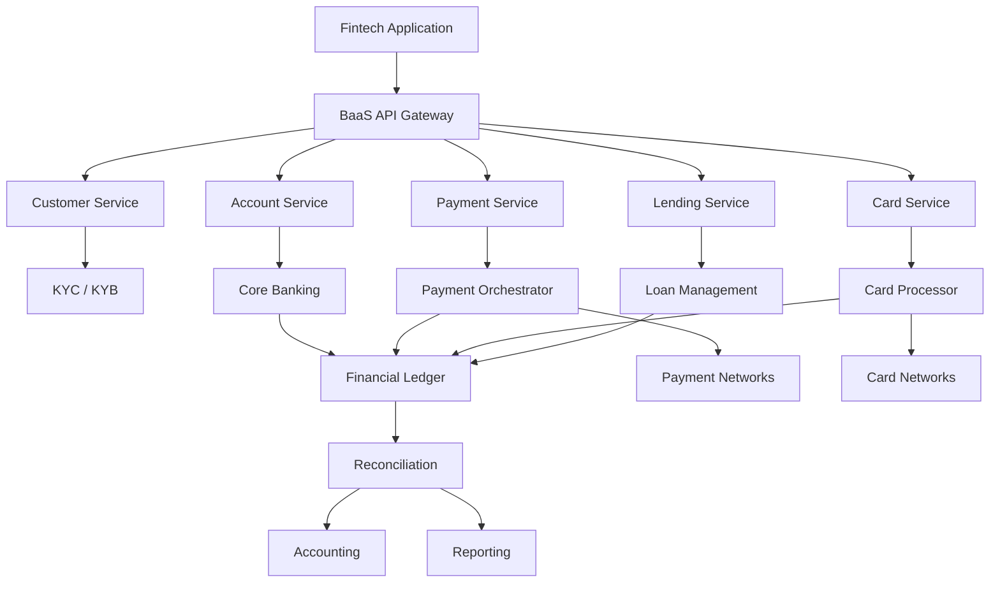
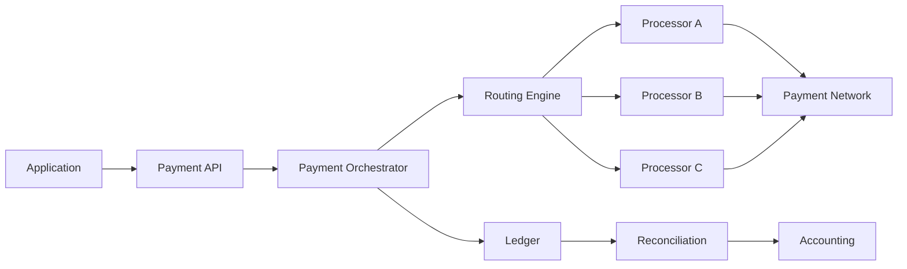
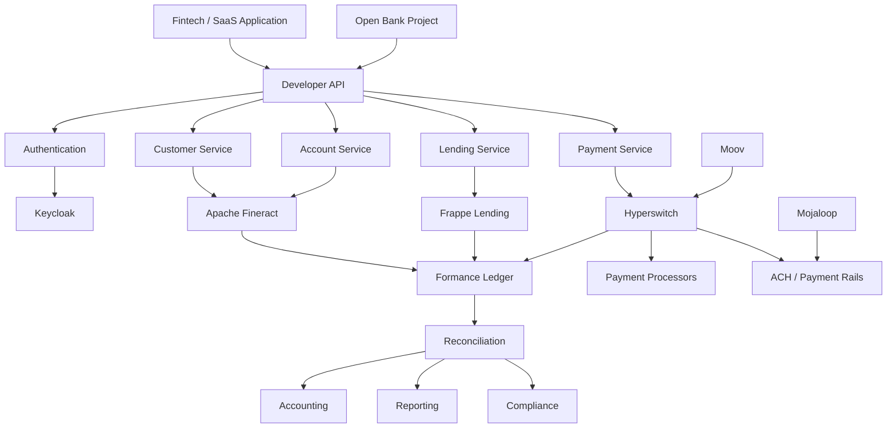

# Awesome-API-Banking-Platform

# 🏦 Top Banking-as-a-Service APIs & Open-Source Banking Infrastructure


> A curated list of **Banking-as-a-Service (BaaS) platforms, embedded banking APIs, core banking platforms, payment infrastructure, financial ledgers and open-source software** for building modern financial products.


Banking APIs allow fintechs and software companies to embed capabilities such as:


* Accounts

* Ledgering

* Payments

* ACH / RTP / FedNow

* Cards

* Card issuing

* Deposits

* Lending

* KYC / KYB

* Compliance

* Money movement

* Reconciliation

* Open Banking

* Banking-as-a-Service


This repository focuses primarily on **open-source and self-hostable alternatives** to commercial BaaS providers such as Treasury Prime, Unit, Synctera, Griffin, Moov, Bankable, Railsr, Solaris, ClearBank and Bond.


There is an important distinction, however: **there is no single open-source project that completely reproduces the regulated banking infrastructure, bank partnerships, licenses, compliance operations and payment-rail access provided by a commercial BaaS platform.**


Instead, an open-source BaaS stack is normally assembled from several layers:


```text

Core Banking

      +

Financial Ledger

      +

Payment Infrastructure

      +

Banking APIs

      +

Cards / Issuing

      +

KYC / KYB

      +

Fraud / Compliance

      +

Reconciliation

      +

Developer APIs

      =

Open-Source BaaS Stack

```


---


## 📑 Table of Contents


* [☁️ SaaS/Hosted Platforms](#️-saashosted-platforms)

* [🌍 Open-Source](#-open-source)

* [🏦 Open-Source Core Banking](#-open-source-core-banking)

* [💰 Open-Source Financial Ledgers](#-open-source-financial-ledgers)

* [💳 Open-Source Payments Infrastructure](#-open-source-payments-infrastructure)

* [🌐 Open Banking APIs](#-open-banking-apis)

* [💸 Open-Source Payment Rails & Messaging](#-open-source-payment-rails--messaging)

* [💳 Open-Source Card & Payment Infrastructure](#-open-source-card--payment-infrastructure)

* [🏦 Open-Source Lending](#-open-source-lending)

* [🧾 Open-Source Accounting & Reconciliation](#-open-source-accounting--reconciliation)

* [🔐 Open-Source KYC, KYB & Compliance](#-open-source-kyc-kyb--compliance)

* [⚙️ Open-Source Fintech Infrastructure](#️-open-source-fintech-infrastructure)

* [🧩 Commercial Platform → Open-Source Equivalent](#-commercial-platform--open-source-equivalent)

* [🏗️ Banking-as-a-Service Architecture](#️-banking-as-a-service-architecture)

* [🔄 Open-Source BaaS Architecture](#-open-source-baas-architecture)

* [💳 Open-Source Payments Architecture](#-open-source-payments-architecture)

* [⚖️ Commercial vs Open-Source](#️-commercial-vs-open-source)

* [🚀 Recommended Open-Source Stacks](#-recommended-open-source-stacks)

* [📊 Banking Infrastructure Comparison](#-banking-infrastructure-comparison)

* [🎯 Recommended Projects by Use Case](#-recommended-projects-by-use-case)

* [🏢 Building a Treasury Prime Alternative](#-building-a-treasury-prime-alternative)

* [🏦 Building an Open-Source BaaS](#-building-an-open-source-baas)

* [🌐 Open-Source Banking Landscape](#-open-source-banking-landscape)

* [🧠 Why Open-Source Banking Infrastructure Matters](#-why-open-source-banking-infrastructure-matters)

* [🤝 Contributing](#-contributing)

* [⚠️ Disclaimer](#️-disclaimer)


---


# ☁️ SaaS/Hosted Platforms


Commercial BaaS platforms provide APIs on top of regulated banking relationships, payment networks, compliance infrastructure and operational capabilities.


| Platform                                         | Company        | Primary Focus                | Key Capabilities                                                 | Starting Pricing                                                                                                                                                                                            | Free Tier / Trial Limits                                                                                                                                                     |
| ------------------------------------------------ | -------------- | ---------------------------- | ---------------------------------------------------------------- | ----------------------------------------------------------------------------------------------------------------------------------------------------------------------------------------------------------- | ---------------------------------------------------------------------------------------------------------------------------------------------------------------------------- |
| [Treasury Prime](https://www.treasuryprime.com/) | Treasury Prime | Banking-as-a-Service         | Accounts, cards, payments, ledgering and embedded banking        | Starts at ~$2,000 – $3,000/mo platform fee + per-account ($0.25–$1.00/mo), ACH ($0.15–$0.50/tx), Wire ($10–$15/tx); retains 50%–90% interchange                                                            | Free Developer Sandbox with no expiration; unlimited test bank accounts, simulated ACH/wire transfers, and test card creation ($0 test mode)                                  |
| [Unit](https://www.unit.co/)                     | Unit           | Embedded banking             | Accounts, cards, payments, lending and compliance infrastructure | Starts at ~$2,500 – $3,500/mo base platform fee (startup tier) + ~$0.20–$0.50/ACH, $10/wire, $0.10/virtual card; interchange revenue share                                                                | Free Developer Sandbox with no expiration; full replica of production environment with unlimited simulated payments, test accounts, and webhooks                              |
| [Synctera](https://www.synctera.com/)            | Synctera       | BaaS                         | Accounts, cards, payments, ledger and compliance                 | Starts at ~$2,000 – $3,500/mo base platform fee (Launch tier) + ~$10,000 setup fee; ~$0.25/ACH, ~$1.50/KYC check, ~$0.50/mo per active account; 70/30 interchange split                                    | Free Developer Sandbox (Build tier) with no expiration; test core banking, account opening, simulated cards, and simulated payment rails                                     |
| [Griffin](https://griffin.com/)                  | Griffin        | Banking infrastructure       | API-first banking, accounts, payments and banking operations     | Business accounts from £100/mo; Platform banking (BaaS) from £15,000 onboarding fee + £3,500/mo minimum spend package (draws down per transaction: accounts, payments, onboarding)                         | Free Developer Sandbox with no expiration; unlimited test UK bank accounts, simulated Faster Payments, and onboarding verification sandbox                                   |
| [Moov](https://moov.io/)                         | Moov           | Payments / embedded finance  | ACH, RTP, FedNow, cards, payments and money movement             | Starts at $500/mo minimum spend; Card processing: Interchange + 0.60% + $0.15; ACH: $0.25–$0.40/tx; Instant payments (RTP/Push-to-card): 0.95% (min $0.50, cap $5.00); Active wallet: $0.50/mo            | Free Developer Sandbox with no expiration; full API access, simulated ACH/FedNow/RTP/card rails, and test-mode dashboard with $0 charges                                     |
| [Bankable](https://www.bankable.co.uk/)          | Bankable       | BaaS                         | Banking and payment infrastructure                               | Starts at ~£3,000 – £5,000/mo platform fee + ~£15,000–£30,000 setup fee + variable volume fees per card and transaction                                                                                     | 30-day proof-of-concept / sandbox trial upon sales approval; limited to staging environment with simulated card and payment APIs                                             |
| [Railsr](https://railsr.com/)                    | Railsr         | Embedded finance             | Banking, cards, payments and financial products                  | Starts at ~£2,500 – £4,000/mo platform fee + ~£15,000 onboarding fee + ~£0.20/virtual card, ~£2.50/physical card, plus per-transaction fees                                                                | Free Developer Sandbox with no expiration; test API keys, simulated account ledgering, test card generation, and test rail execution                                         |
| [Solaris](https://www.solarisgroup.com/)         | Solaris        | BaaS                         | Banking, payments, cards and embedded financial products         | Starts at ~€3,000 – €5,000/mo platform minimum fee + ~€20,000 onboarding fee + €0.50–€1.00/mo per active account + €0.10–€0.25 per SEPA transaction                                                          | Free Developer Sandbox (Solaris Testing Environment) with no expiration; mock IBAN accounts, simulated SEPA clearing, and test card authorization                             |
| [ClearBank](https://clear.bank/)                 | ClearBank      | Banking infrastructure       | Accounts, payments, clearing and banking connectivity            | Starts at ~£2,500 – £5,000/mo minimum spend + ~£10,000 onboarding fee; Faster Payments: £0.05–£0.15/tx; BACS: £0.02–£0.05/tx; CHAPS: £5.00/tx                                                               | Free Developer Portal & Simulation Sandbox with no expiration; simulated UK clearing rails (FPS, BACS, CHAPS), test virtual accounts, and webhook simulators                |
| [Bond](https://www.bond.tech/)                   | Bond           | Embedded banking             | Banking, cards, credit and financial infrastructure              | Starts at ~$2,500/mo minimum platform commitment + $0.15/virtual card, $2.50/physical card, and 0.20% + $0.10 per transaction                                                                             | Free Developer Sandbox with no expiration; test credit/debit card simulations, synthetic KYC evaluations, and sandbox ledgers                                                |
| [Unit21](https://www.unit21.ai/)                 | Unit21         | Financial infrastructure     | Compliance, fraud and financial-crime operations                 | Starts at ~$33,000/year (~$2,750/mo) entry contract (average ~$160,000/year based on alert volume, rule executions, and tracked entities)                                                                   | 14 to 30-day proof-of-concept sandbox trial upon sales qualification; includes test rule engine tuning and synthetic transaction monitoring                                  |
| [Galileo](https://www.galileo-ft.com/)           | Galileo        | Financial API infrastructure | Accounts, cards and payments                                     | Starts at ~$3,000 – $5,000/mo base platform fee + setup fee + $0.15–$0.30/active account/mo and ~$0.05–$0.10 per transaction                                                                                 | Free Developer Sandbox with no expiration; simulated card issuing, account authorization endpoints, and mock transaction simulators                                          |
| [Marqeta](https://www.marqeta.com/)              | Marqeta        | Card issuing                 | Card issuing and payment infrastructure                          | Starts at ~$2,500 – $5,000/mo minimum platform commitment + ~$0.10–$0.25 per virtual card, ~$2.00–$3.50 per physical card; interchange revenue share                                                       | Free Developer Sandbox with no expiration; instant self-service API keys, test card issuing simulator, simulated funding accounts, and webhook test tools                    |
| [Adyen Issuing](https://www.adyen.com/)          | Adyen          | Embedded payments            | Payments, issuing and financial products                         | $0 setup fee, $0 monthly platform fee; €0.11 ($0.13) fixed processing fee + Interchange++ / payment method fee per transaction (~$120/mo invoice minimum)                                                   | Free Developer Test Account with no expiration; unlimited test card issuing, mock authorisations, test API credentials, and simulated webhook events                          |
| [Stripe Treasury](https://stripe.com/treasury)   | Stripe         | Financial accounts           | Accounts, money movement and embedded finance                    | $0/mo account fee; Outbound ACH: $0.25/tx; Inbound ACH debit: $0.25/tx; Domestic Wire: $8.00/tx; Check deposit: $1.50/check                                                                                | Free Developer Test Mode with no expiration; unlimited test accounts, simulated bank transfers, instant balance test adjustments, and test webhooks                         |
| [Stripe Issuing](https://stripe.com/issuing)     | Stripe         | Card issuing                 | Virtual and physical cards                                       | $0.10 per virtual card; $3.00 per physical card; 0.2% + $0.20 per transaction (waived on first $500,000 in spend volume); $0 monthly fee                                                                   | 100% fee-free transactions on first $500,000 in card spend; free Developer Test Mode with no expiration for unlimited virtual card testing                                  |
| [Column](https://column.com/)                    | Column         | Banking infrastructure       | Banking, payments and programmable financial infrastructure      | Starts at ~$2,000 – $5,000/mo platform minimum + rail cost-basis (ACH: ~$0.05–$0.15/tx, Wire: ~$1.50–$3.00/tx, RTP/FedNow: ~$0.10–$0.25/tx) + interchange sharing                                         | Free Developer Sandbox with no expiration; feature-complete production replica, persistent test state, simulated ACH/wire settlement, and event webhooks                     |
| [Lead Bank](https://www.lead.bank/)              | Lead Bank      | Banking infrastructure       | Embedded banking and fintech partnerships                        | Starts at ~$3,000 – $5,000/mo platform minimum + pass-through network costs (ACH ~$0.15–$0.30/tx, Wire ~$10–$15/tx) + interchange share                                                                      | Free Developer Sandbox upon onboarding; simulated accounts, test transaction flows, and API verification tools (no expiration in sandbox)                                  |
| [Increase](https://increase.com/)                | Increase       | Banking APIs                 | ACH, wire, card issuing and financial infrastructure             | Next-day ACH: $0.50/tx; Same-day ACH: $2.00/tx; Wire: $15.00/tx; RTP: $2.50/tx; FedNow: $2.50/tx; Virtual card: $0.25/card; Check print & mail: $3.00/check; $0 base monthly fee for direct business accounts | First 10 account numbers free; first 5 physical cards free; free unlimited Developer Sandbox with no expiration, test API keys, and simulated clearing cycles                |


---


# 🌍 Open-Source


Unlike hosted BaaS providers, open-source banking infrastructure is generally **composable**.


The most important projects fall into several layers:


```text

                         OPEN-SOURCE BaaS

                                │

        ┌───────────────────────┼───────────────────────┐

        │                       │                       │

        ▼                       ▼                       ▼

   Core Banking              Ledger                Payments

        │                       │                       │

        ▼                       ▼                       ▼

   Apache Fineract          Formance             Hyperswitch

   Mifos X                  Lago / Kill Bill     Moov

        │                       │                       │

        └───────────────────────┼───────────────────────┘

                                │

                                ▼

                         Banking APIs

                                │

                                ▼

                        Open Bank Project

                                │

                                ▼

                      Applications / Fintechs

```


---


# 🏦 Open-Source Core Banking


## Apache Fineract


[Apache Fineract](https://github.com/apache/fineract) is one of the most important open-source core banking platforms.


It provides:


* Client management

* Savings

* Loans

* Portfolio management

* Accounting

* Reporting

* Financial products

* REST APIs

* Cloud-ready architecture


Fineract is designed as a headless core banking platform with open APIs.


| Project                                                     | Description                                          | License               |

| ----------------------------------------------------------- | ---------------------------------------------------- | --------------------- |

| [Apache Fineract](https://github.com/apache/fineract)       | API-first core banking platform                      | Apache-2.0            |

| [Mifos X](https://github.com/openMF/mifos-x)                | Full core banking distribution built around Fineract | MPL-2.0               |

| [Mifos](https://mifos.org/)                                 | Open-source digital financial services ecosystem     | Multiple OSS licenses |

| [Apache Fineract CN](https://github.com/apache/fineract-cn) | Modular next-generation financial services platform  | Apache-2.0            |


Mifos X combines the Fineract backend with web/mobile applications, reporting and related financial-services components.


---


# 💰 Open-Source Financial Ledgers


A programmable ledger is one of the most important components when building a BaaS platform.


```text

             Financial Transaction

                       │

                       ▼

              ┌─────────────────┐

              │  Ledger Engine   │

              └────────┬────────┘

                       │

              ┌────────┴────────┐

              ▼                 ▼

          Debit Account     Credit Account

              │                 │

              └────────┬────────┘

                       ▼

                Double-Entry

                  Accounting

```


| Project                                                 | Description                              |

| ------------------------------------------------------- | ---------------------------------------- |

| [Formance Ledger](https://github.com/formancehq/ledger) | Programmable financial ledger            |

| [Formance Stack](https://github.com/formancehq/stack)   | Financial infrastructure platform        |

| [Apache Fineract](https://github.com/apache/fineract)   | Core banking with financial accounting   |

| [Mifos X](https://github.com/openMF/mifos-x)            | Core banking and accounting              |

| [Kill Bill](https://github.com/killbill/killbill)       | Open-source billing and payment platform |

| [ERPNext](https://github.com/frappe/erpnext)            | Open-source ERP and financial accounting |

| [Odoo Community](https://github.com/odoo/odoo)          | Open-source business/accounting platform |


[Formance Ledger](https://github.com/formancehq/ledger) is particularly relevant for fintech applications: it provides atomic multi-posting transactions, account-based modeling and a programmable transaction language.


---


# 🧮 Double-Entry Ledger Architecture


```text

                  Transaction

                       │

                       ▼

              ┌─────────────────┐

              │ Transaction API │

              └────────┬────────┘

                       │

                       ▼

                ┌──────────────┐

                │ Ledger Engine│

                └──────┬───────┘

                       │

             ┌─────────┴─────────┐

             ▼                   ▼

        Debit Ledger        Credit Ledger

             │                   │

             └─────────┬─────────┘

                       ▼

                Immutable Entry

                       │

                       ▼

                 Balance State

```


For serious financial applications, the ledger should generally be treated as the **source of truth**, rather than relying on mutable application-level balances.


---


# 💳 Open-Source Payments Infrastructure


| Project                                                         | Focus                                      |

| --------------------------------------------------------------- | ------------------------------------------ |

| [Hyperswitch](https://github.com/juspay/hyperswitch)            | Payment orchestration                      |

| [Moov](https://github.com/moov-io)                              | Open-source financial infrastructure       |

| [Kill Bill](https://github.com/killbill/killbill)               | Payments and billing                       |

| [Formance](https://github.com/formancehq/stack)                 | Financial flows and payment infrastructure |

| [Mojaloop](https://github.com/mojaloop/mojaloop)                | Interoperable payment platforms            |

| [Apache Fineract](https://github.com/apache/fineract)           | Core financial services                    |

| [Open Bank Project](https://github.com/OpenBankProject/OBP-API) | Open banking APIs                          |


---


## Hyperswitch


[Hyperswitch](https://github.com/juspay/hyperswitch) is an open-source payment infrastructure platform from Juspay.


It provides:


* Payment routing

* Multiple processors

* Retries

* Failover

* Payment methods

* Vaulting

* Tokenization

* Reconciliation

* Observability


Hyperswitch is particularly useful as the **payment orchestration layer** in an open-source BaaS architecture.


```text

                   Payment Request

                         │

                         ▼

                    Hyperswitch

                         │

          ┌──────────────┼──────────────┐

          ▼              ▼              ▼

       Processor A   Processor B   Processor C

          │              │              │

          └──────────────┼──────────────┘

                         ▼

                    Payment Result

```


---


# 🌐 Open Banking APIs


## Open Bank Project


[Open Bank Project](https://github.com/OpenBankProject/OBP-API) provides an open-source REST API layer for banks and financial applications.


It supports:


* Accounts

* Transactions

* Payments

* Counterparties

* Entitlements

* Metadata

* Open Banking

* PSD2 / XS2A

* OAuth

* Open Finance


The API abstracts differences between underlying banking systems, allowing applications to interact with banking services through a standardized API layer.


| Project                                                                | Primary Role                     |

| ---------------------------------------------------------------------- | -------------------------------- |

| [Open Bank Project API](https://github.com/OpenBankProject/OBP-API)    | Open banking API                 |

| [OBP-API Explorer](https://github.com/OpenBankProject/API-Explorer-II) | API exploration                  |

| [Mojaloop](https://github.com/mojaloop/mojaloop)                       | Interoperable financial services |

| [Mifos X](https://github.com/openMF/mifos-x)                           | Core banking APIs                |

| [Apache Fineract](https://github.com/apache/fineract)                  | Core financial APIs              |


---


# 💸 Open-Source Payment Rails & Messaging


Modern BaaS platforms need to communicate with financial networks and payment rails.


| Project                                                   | Technology / Role                              |

| --------------------------------------------------------- | ---------------------------------------------- |

| [Moov ACH](https://github.com/moov-io/ach)                | ACH file processing                            |

| [Moov ISO 8583](https://github.com/moov-io/iso8583)       | ISO 8583 messaging                             |

| [Moov ACH Gateway](https://github.com/moov-io/achgateway) | ACH gateway                                    |

| [Mojaloop](https://github.com/mojaloop/mojaloop)          | Interoperable payment infrastructure           |

| [Apache Camel](https://github.com/apache/camel)           | Financial integration / routing                |

| [jPOS](https://github.com/jpos/jPOS)                      | ISO 8583 payment processing                    |

| [HAPI](https://github.com/hapifhir/hapi-fhir)             | Healthcare financial-adjacent interoperability |


Moov's open-source organization includes components for ACH processing, ACH gateway functionality and ISO 8583 messaging.


> Open-source software can implement protocols and processing logic, but **access to regulated payment networks such as ACH, FedNow, RTP, card networks and correspondent banking still requires appropriate financial-institution relationships and operational/compliance infrastructure.**


---


# 💳 Open-Source Card & Payment Infrastructure


Fully open-source card issuing is considerably harder than open-source software for ACH or ledgers because card networks, processors, BIN sponsorship, authorization, settlement and compliance are external regulated systems.


Useful building blocks include:


| Project                                               | Role                               |

| ----------------------------------------------------- | ---------------------------------- |

| [Moov](https://github.com/moov-io)                    | Financial infrastructure libraries |

| [Hyperswitch](https://github.com/juspay/hyperswitch)  | Payment orchestration              |

| [jPOS](https://github.com/jpos/jPOS)                  | ISO 8583 / transaction processing  |

| [Formance](https://github.com/formancehq/stack)       | Financial ledger / money flows     |

| [Apache Fineract](https://github.com/apache/fineract) | Accounts and financial products    |

| [Mifos X](https://github.com/openMF/mifos-x)          | Core banking                       |


---


# 🏦 Open-Source Lending


Lending is another major component of BaaS.


```text

Application

     │

     ▼

Credit Decision

     │

     ▼

Loan Origination

     │

     ▼

Loan Account

     │

     ▼

Disbursement

     │

     ▼

Repayment

     │

     ▼

Ledger

```


| Project                                               | Description                       |

| ----------------------------------------------------- | --------------------------------- |

| [Frappe Lending](https://github.com/frappe/lending)   | Open-source loan management       |

| [Apache Fineract](https://github.com/apache/fineract) | Loans and financial products      |

| [Mifos X](https://github.com/openMF/mifos-x)          | Loan and savings management       |

| [ERPNext](https://github.com/frappe/erpnext)          | Financial and business management |


[Frappe Lending](https://github.com/frappe/lending) provides an open-source loan management system covering loan products, origination, disbursement, repayment, collateral and accounting.


---


# 🧾 Open-Source Accounting & Reconciliation


A production BaaS platform needs more than payment processing.


It must reconcile:


```text

Bank / Processor

       │

       ▼

Transaction Files

       │

       ▼

Normalization

       │

       ▼

Internal Ledger

       │

       ▼

Reconciliation Engine

       │

       ├── Matched

       ├── Unmatched

       └── Exceptions

```


Useful projects include:


| Project                                                 | Role                         |

| ------------------------------------------------------- | ---------------------------- |

| [Formance Ledger](https://github.com/formancehq/ledger) | Double-entry ledger          |

| [Apache Fineract](https://github.com/apache/fineract)   | Banking accounting           |

| [ERPNext](https://github.com/frappe/erpnext)            | Accounting / ERP             |

| [Odoo Community](https://github.com/odoo/odoo)          | Accounting / ERP             |

| [Kill Bill](https://github.com/killbill/killbill)       | Billing / payment accounting |

| [Hyperswitch](https://github.com/juspay/hyperswitch)    | Payment reconciliation       |


---


# 🔐 Open-Source KYC, KYB & Compliance


There is no single mature open-source equivalent to the complete compliance stack of a commercial BaaS provider.


Instead, open-source implementations can combine:


```text

Identity Verification

        +

Business Verification

        +

Sanctions Screening

        +

PEP Screening

        +

Transaction Monitoring

        +

Fraud Detection

        +

Case Management

        +

Audit Logs

```


Useful building blocks include:


| Project / Technology                                            | Role                              |

| --------------------------------------------------------------- | --------------------------------- |

| [OpenSanctions](https://github.com/opensanctions/opensanctions) | Sanctions / entity data           |

| [OpenRefine](https://github.com/OpenRefine/OpenRefine)          | Data cleaning / entity processing |

| [Apache Fineract](https://github.com/apache/fineract)           | Customer/account records          |

| [Open Bank Project](https://github.com/OpenBankProject/OBP-API) | Banking API layer                 |

| [Mojaloop](https://github.com/mojaloop/mojaloop)                | Financial infrastructure          |

| PostgreSQL                                                      | Customer / compliance data        |

| Keycloak                                                        | Identity and authentication       |

| Open Policy Agent                                               | Policy engine                     |


> Compliance software does **not** itself make a fintech compliant. Licensing, KYC/KYB procedures, AML programs, regulatory reporting, risk management and banking relationships remain organizational and regulatory responsibilities.


---


# ⚙️ Open-Source Fintech Infrastructure


| Layer            | Open-Source Projects         |

| ---------------- | ---------------------------- |

| Core Banking     | Apache Fineract, Mifos X     |

| Ledger           | Formance Ledger              |

| Payments         | Hyperswitch, Moov, Kill Bill |

| Open Banking     | Open Bank Project            |

| Payment Networks | Mojaloop                     |

| ACH              | Moov ACH                     |

| ISO 8583         | jPOS, Moov ISO 8583          |

| Lending          | Frappe Lending, Fineract     |

| Accounting       | ERPNext, Odoo                |

| Identity         | Keycloak                     |

| Policy           | Open Policy Agent            |

| Data             | PostgreSQL                   |

| Messaging        | Kafka, NATS                  |

| API Gateway      | Kong, Traefik                |

| Workflow         | Temporal, Camunda            |

| Observability    | Prometheus, Grafana          |

| Containers       | Docker, Kubernetes           |

| Secrets          | HashiCorp Vault              |

| Object Storage   | MinIO                        |


---


# 🧩 Commercial Platform → Open-Source Equivalent


| Commercial BaaS               | Open-Source Equivalent / Building Blocks                      |

| ----------------------------- | ------------------------------------------------------------- |

| **Treasury Prime**            | Apache Fineract + Formance + Moov + Open Bank Project         |

| **Unit**                      | Fineract + Formance + Hyperswitch + Keycloak                  |

| **Synctera**                  | Fineract + Formance + Hyperswitch + compliance stack          |

| **Griffin**                   | Fineract + Formance + Moov + Open Bank Project                |

| **Moov**                      | Moov OSS + Formance + Hyperswitch + Fineract                  |

| **Bankable**                  | Fineract + Formance + Hyperswitch + Open Bank Project         |

| **Railsr**                    | Fineract + Formance + Hyperswitch + Keycloak                  |

| **Solaris**                   | Fineract + Formance + Moov + Open Bank Project                |

| **ClearBank**                 | Fineract + Formance + Mojaloop + Moov                         |

| **Bond**                      | Fineract + Formance + Hyperswitch + card/payment integrations |

| **Galileo**                   | Fineract + Moov + jPOS + Formance                             |

| **Stripe Treasury**           | Fineract + Formance + Hyperswitch + Open Bank Project         |

| **Stripe Issuing**            | Formance + Moov + jPOS + external card-network connectivity   |

| **Column**                    | Fineract + Formance + Moov + banking integrations             |

| **Embedded Banking Platform** | Fineract + Formance + Open Bank Project + Hyperswitch         |

| **Payment-focused BaaS**      | Hyperswitch + Formance + Moov                                 |

| **Lending-focused BaaS**      | Fineract + Frappe Lending + Formance                          |

| **Open Banking Platform**     | Open Bank Project + Fineract + Keycloak                       |

| **Full Open-Source BaaS**     | Fineract + Formance + Hyperswitch + Moov + OBP + Keycloak     |


---


# 🏗️ Banking-as-a-Service Architecture





---


# 🔄 Open-Source BaaS Architecture


A practical self-hosted architecture can look like:


```text

                         FINTECH APPLICATION

                                  │

                                  ▼

                           API GATEWAY

                                  │

                   ┌──────────────┼──────────────┐

                   │              │              │

                   ▼              ▼              ▼

               Accounts       Payments        Lending

                   │              │              │

                   ▼              ▼              ▼

              Fineract       Hyperswitch     Frappe Lending

                   │              │              │

                   └──────────────┼──────────────┘

                                  ▼

                           Formance Ledger

                                  │

                    ┌─────────────┼─────────────┐

                    │             │             │

                    ▼             ▼             ▼

                PostgreSQL      Kafka          Object Storage

                    │

                    ▼

              Reconciliation

                    │

          ┌─────────┴─────────┐

          ▼                   ▼

      Accounting          Reporting

```


---


# 💳 Open-Source Payments Architecture





Possible implementation:


```text

Payment API

    │

    ▼

Hyperswitch

    │

    ├── Stripe / Adyen / Processor

    ├── Bank Transfer

    ├── ACH

    └── Other PSPs

    │

    ▼

Formance Ledger

    │

    ▼

Reconciliation

```


---


# 🏦 Open-Source Core Banking Architecture


```text

                  CUSTOMER

                     │

                     ▼

                API Gateway

                     │

                     ▼

              Apache Fineract

                     │

        ┌────────────┼────────────┐

        ▼            ▼            ▼

    Customers      Accounts      Loans

        │            │            │

        └────────────┼────────────┘

                     ▼

                Accounting

                     │

                     ▼

                  Ledger

                     │

                     ▼

                Reporting

```


Apache Fineract is explicitly designed as a headless platform with open APIs, making it particularly suitable as the core banking layer behind custom fintech applications.


---


# 💰 Open-Source Ledger Architecture


```text

                     Money Movement

                           │

                           ▼

                    Transaction API

                           │

                           ▼

                    ┌─────────────┐

                    │   Formance  │

                    │    Ledger   │

                    └──────┬──────┘

                           │

             ┌─────────────┼─────────────┐

             ▼             ▼             ▼

         Customer       Merchant        Bank

          Account        Account       Account

             │             │             │

             └─────────────┼─────────────┘

                           ▼

                    Double Entry

                           │

                           ▼

                    Reconciliation

```


---


# 🧩 Full Open-Source BaaS Stack


One possible stack:


```text

┌─────────────────────────────────────────────┐

│              FINTECH APPLICATION            │

└──────────────────────┬──────────────────────┘

                       │

┌──────────────────────▼──────────────────────┐

│              API / AUTH LAYER               │

│        Kong + Keycloak + OpenAPI            │

└──────────────────────┬──────────────────────┘

                       │

        ┌──────────────┼──────────────┐

        │              │              │

        ▼              ▼              ▼

     Fineract       Hyperswitch      Lending

        │              │              │

        │              │         Frappe Lending

        │              │              │

        └──────────────┼──────────────┘

                       ▼

                Formance Ledger

                       │

        ┌──────────────┼──────────────┐

        ▼              ▼              ▼

   PostgreSQL        Kafka          MinIO

        │

        ▼

  Reconciliation

        │

        ▼

 Accounting / BI

```


---


# ⚖️ Commercial vs Open-Source


| Capability                   | Commercial BaaS                 | Open-Source Stack             |

| ---------------------------- | ------------------------------- | ----------------------------- |

| Core Banking                 | ✅                               | ✅                             |

| APIs                         | ✅                               | ✅                             |

| Ledger                       | ✅                               | ✅                             |

| Payments                     | ✅                               | ✅                             |

| ACH Processing               | ✅                               | ✅ Building Blocks             |

| Card Issuing                 | ✅                               | ⚠️ Requires external networks |

| Bank Account Access          | ✅                               | ⚠️ Requires bank integration  |

| Bank Sponsorship             | ✅                               | ❌                             |

| Regulatory License           | Often provided through partners | ❌                             |

| KYC/KYB                      | Usually integrated              | Build / integrate             |

| AML                          | Usually integrated              | Build / integrate             |

| Fraud                        | Usually integrated              | Build / integrate             |

| Compliance Operations        | Managed                         | Self-managed                  |

| Infrastructure               | Managed                         | Self-managed                  |

| Customization                | Medium                          | Very High                     |

| Data Ownership               | Vendor-dependent                | Full control                  |

| Vendor Lock-in               | Higher                          | Lower                         |

| Air-Gapped Deployment        | Limited                         | ✅                             |

| Self Hosting                 | Limited                         | ✅                             |

| Source Code                  | Usually proprietary             | ✅                             |

| Model / Architecture Control | Limited                         | High                          |

| Time to Market               | Fast                            | Slower                        |

| Operational Complexity       | Lower                           | Higher                        |

| Banking Relationships        | Included / facilitated          | Must establish independently  |

| Regulatory Burden            | Reduced                         | Full responsibility           |


---


# 📊 Banking Infrastructure Comparison


| Project           | Core Banking | Ledger | Payments | Open Banking | Lending | Self-Host |

| ----------------- | :----------: | :----: | :------: | :----------: | :-----: | :-------: |

| Apache Fineract   |       ✅      |    ✅   |    ⚠️    |      ⚠️      |    ✅    |     ✅     |

| Mifos X           |       ✅      |    ✅   |    ⚠️    |      ⚠️      |    ✅    |     ✅     |

| Formance          |       ❌      |    ✅   |     ✅    |       ❌      |    ⚠️   |     ✅     |

| Hyperswitch       |       ❌      |   ⚠️   |     ✅    |       ❌      |    ❌    |     ✅     |

| Moov              |       ❌      |   ⚠️   |     ✅    |       ❌      |    ❌    |     ✅     |

| Mojaloop          |       ❌      |   ⚠️   |     ✅    |      ⚠️      |    ❌    |     ✅     |

| Open Bank Project |       ❌      |    ❌   |     ✅    |       ✅      |    ❌    |     ✅     |

| Frappe Lending    |       ❌      |   ⚠️   |     ❌    |       ❌      |    ✅    |     ✅     |

| Kill Bill         |       ❌      |   ⚠️   |     ✅    |       ❌      |    ❌    |     ✅     |

| ERPNext           |       ❌      |    ✅   |    ⚠️    |       ❌      |    ⚠️   |     ✅     |

| jPOS              |       ❌      |    ❌   |     ✅    |       ❌      |    ❌    |     ✅     |


---


# 🎯 Recommended Projects by Use Case


| Use Case                             | Recommended Starting Point                   |

| ------------------------------------ | -------------------------------------------- |

| Full open-source core banking        | **Apache Fineract**                          |

| Complete core banking distribution   | **Mifos X**                                  |

| Programmable fintech ledger          | **Formance Ledger**                          |

| Payment orchestration                | **Hyperswitch**                              |

| ACH processing                       | **Moov ACH**                                 |

| ISO 8583 processing                  | **jPOS / Moov ISO 8583**                     |

| Open Banking API                     | **Open Bank Project**                        |

| Interoperable payment infrastructure | **Mojaloop**                                 |

| Lending platform                     | **Frappe Lending**                           |

| Billing + payments                   | **Kill Bill**                                |

| Financial ERP                        | **ERPNext**                                  |

| API-first core banking               | **Apache Fineract**                          |

| Embedded-finance backend             | **Fineract + Formance**                      |

| Payment-focused fintech              | **Hyperswitch + Formance**                   |

| Lending fintech                      | **Fineract + Frappe Lending + Formance**     |

| Open Banking fintech                 | **Open Bank Project + Fineract**             |

| Full self-hosted BaaS                | **Fineract + Formance + Hyperswitch + Moov** |


---


# 🏢 Building a Treasury Prime Alternative


A Treasury Prime-style platform can be decomposed into:


```text

                         FINTECH

                            │

                            ▼

                       BaaS API

                            │

            ┌───────────────┼───────────────┐

            │               │               │

            ▼               ▼               ▼

         Accounts        Payments          Cards

            │               │               │

            ▼               ▼               ▼

        Fineract        Hyperswitch       Moov

            │               │               │

            └───────────────┼───────────────┘

                            ▼

                     Formance Ledger

                            │

             ┌──────────────┼──────────────┐

             ▼              ▼              ▼

         Reporting     Reconciliation   Compliance

```


### Suggested Components


```text

Core Banking      → Apache Fineract

Ledger            → Formance

Payments          → Hyperswitch

ACH               → Moov ACH

ISO 8583          → jPOS / Moov ISO 8583

Open Banking      → Open Bank Project

Lending           → Frappe Lending

Authentication    → Keycloak

API Gateway       → Kong

Database          → PostgreSQL

Messaging         → Kafka / NATS

Workflow          → Temporal

Observability     → Prometheus + Grafana

```


---


# 🏦 Building an Open-Source BaaS


The complete architecture can be visualized as:





---


# 🧱 Banking Infrastructure Layers


```text

┌───────────────────────────────────────────────┐

│             FINTECH APPLICATIONS              │

│   Neobanks • Wallets • Lending • Payroll      │

└───────────────────────┬───────────────────────┘

                        │

┌───────────────────────▼───────────────────────┐

│                  BaaS APIs                    │

│ Accounts • Cards • Payments • Loans • KYC     │

└───────────────────────┬───────────────────────┘

                        │

┌───────────────────────▼───────────────────────┐

│              FINANCIAL SERVICES              │

│ Fineract • Hyperswitch • Frappe Lending       │

└───────────────────────┬───────────────────────┘

                        │

┌───────────────────────▼───────────────────────┐

│                   LEDGER                      │

│              Formance / Fineract              │

└───────────────────────┬───────────────────────┘

                        │

┌───────────────────────▼───────────────────────┐

│             PAYMENT INFRASTRUCTURE            │

│ Moov • jPOS • Hyperswitch • Mojaloop          │

└───────────────────────┬───────────────────────┘

                        │

┌───────────────────────▼───────────────────────┐

│             BANKING NETWORKS                  │

│ ACH • RTP • FedNow • Cards • SWIFT • SEPA     │

└───────────────────────────────────────────────┘

```


---


# 🌐 Open-Source Banking Landscape


```mermaid

mindmap

  root((Open-Source Banking))

    Core Banking

      Apache Fineract

      Mifos X

      Fineract CN

    Ledger

      Formance Ledger

      Fineract

      ERPNext

    Payments

      Hyperswitch

      Moov

      Kill Bill

      Formance

    Payment Rails

      Moov ACH

      jPOS

      ISO 8583

      Mojaloop

    Open Banking

      Open Bank Project

      PSD2

      XS2A

      Open Finance

    Lending

      Frappe Lending

      Fineract

      Mifos

    Accounting

      ERPNext

      Odoo

      Kill Bill

    Identity

      Keycloak

      Open Policy Agent

    Infrastructure

      PostgreSQL

      Kafka

      NATS

      Kubernetes

      Docker

    Applications

      Neobanks

      Wallets

      Lending

      Payroll

      Expense Management

      Embedded Finance

```


---


# 🧠 Why Open-Source Banking Infrastructure Matters


Commercial BaaS platforms dramatically reduce the effort required to launch financial products, but they also introduce dependencies on:


* Vendors

* Banking partners

* Payment processors

* Proprietary APIs

* Pricing models

* Platform availability

* Data residency

* Product roadmaps

* Compliance infrastructure


Open-source infrastructure provides an alternative architectural philosophy:


```text

                  Traditional BaaS


               ┌─────────────────┐

               │    BaaS Vendor  │

               └────────┬────────┘

                        │

                  Proprietary API

                        │

                        ▼

                    Fintech App


                  Open-Source BaaS


                    Fintech App

                         │

                         ▼

                     Your API

                         │

          ┌──────────────┼──────────────┐

          ▼              ▼              ▼

       Fineract       Formance      Hyperswitch

          │              │              │

          └──────────────┼──────────────┘

                         ▼

                  Your Infrastructure

```


The biggest advantage is not necessarily eliminating every external dependency.


It is being able to **own the software layer between your application and financial infrastructure**.


---


# 🔥 Open-Source BaaS Reference Stack


A strong general-purpose architecture is:


```text

                        APPLICATION

                            │

                            ▼

                     API GATEWAY

                     Kong / Traefik

                            │

                            ▼

                       KEYCLOAK

                            │

          ┌─────────────────┼─────────────────┐

          │                 │                 │

          ▼                 ▼                 ▼

       FINERACT         HYPERSWITCH       LENDING

          │                 │                 │

          │                 │          FRAPPE LENDING

          │                 │                 │

          └─────────────────┼─────────────────┘

                            ▼

                     FORMANCE LEDGER

                            │

                ┌───────────┼───────────┐

                ▼           ▼           ▼

            POSTGRES      KAFKA        MINIO

                │

                ▼

          RECONCILIATION

                │

        ┌───────┴────────┐

        ▼                ▼

    ACCOUNTING        ANALYTICS

```


---


# 🧩 Commercial BaaS → OSS Architecture Mapping


```text

Treasury Prime

      │

      ├── Banking API        → Open Bank Project

      ├── Core Banking       → Apache Fineract

      ├── Ledger             → Formance

      ├── Payments           → Hyperswitch

      └── ACH                → Moov


Unit

      │

      ├── Accounts           → Fineract

      ├── Ledger             → Formance

      ├── Payments           → Hyperswitch

      ├── Lending            → Frappe Lending

      └── Identity           → Keycloak


Synctera

      │

      ├── Core Banking       → Fineract

      ├── Ledger             → Formance

      ├── Payments           → Hyperswitch

      └── Compliance        → Open-source components + custom systems


Moov

      │

      ├── ACH                → Moov ACH

      ├── ISO 8583           → Moov ISO 8583

      ├── Payments           → Hyperswitch

      └── Ledger             → Formance


ClearBank / Solaris / Griffin

      │

      ├── Core Banking       → Fineract

      ├── Ledger             → Formance

      ├── Payment APIs       → Hyperswitch / Moov

      ├── Open Banking       → Open Bank Project

      └── Interoperability   → Mojaloop

```


---


# 🚀 Minimal Self-Hosted BaaS


For experimentation, an initial stack could be:


```text

Apache Fineract

+

Formance Ledger

+

Hyperswitch

+

PostgreSQL

+

Keycloak

+

Docker

```


Then progressively add:


```text

       ┌───────────────────────┐

       │       Fineract        │

       │      Core Banking     │

       └───────────┬───────────┘

                   │

       ┌───────────▼───────────┐

       │   Formance Ledger     │

       │  Financial Source     │

       │       of Truth        │

       └───────────┬───────────┘

                   │

       ┌───────────▼───────────┐

       │     Hyperswitch       │

       │ Payment Orchestration │

       └───────────┬───────────┘

                   │

       ┌───────────▼───────────┐

       │         Moov          │

       │ ACH / Financial APIs  │

       └───────────────────────┘

```


---


# 🤝 Contributing


Contributions are welcome!


Please consider adding:


* Open-source core banking systems

* Banking APIs

* Financial ledgers

* Payment orchestration platforms

* ACH software

* ISO 8583 implementations

* Card-processing infrastructure

* Open Banking APIs

* Lending platforms

* Accounting systems

* Reconciliation engines

* KYC/KYB infrastructure

* AML tooling

* Fraud detection systems

* Payment networks

* Financial messaging systems

* Developer SDKs

* Banking simulators

* Fintech infrastructure

* Self-hosted BaaS projects

* Open-source neobank platforms


When adding a project, please distinguish between:


* **Fully open-source**

* **Open-core**

* **Source available**

* **Hosted open-source project**

* **Open-source library**

* **Commercial platform using open-source components**


Do not label a proprietary BaaS product as open source simply because it exposes APIs or uses open-source components.


---


# ⚠️ Disclaimer


This repository is an independent technical curation and is **not affiliated with or endorsed by any company or project listed here**.


Banking infrastructure is fundamentally different from ordinary SaaS infrastructure.


Open-source software can provide:


* Core banking functionality

* APIs

* Ledgers

* Payment orchestration

* Accounting

* Reconciliation

* Lending

* Open Banking

* Protocol implementations


But software alone does **not** provide:


* A banking charter

* Deposit insurance

* Bank sponsorship

* Access to card networks

* Direct access to ACH

* Direct access to FedNow

* Direct access to RTP

* Regulatory authorization

* AML program ownership

* KYC obligations

* Money-transmitter licensing

* Capital requirements

* Banking operations


Therefore, an "open-source Treasury Prime alternative" should be understood as an **open-source software architecture capable of implementing many of the software layers of a BaaS platform**, rather than a drop-in replacement for the regulated banking relationships and infrastructure of a commercial BaaS provider.


Licenses also vary across projects. Always verify the current project, dependency and model/data licenses before commercial deployment.


---


## ⭐ Star This Repository


If you are interested in:


* Banking-as-a-Service

* Embedded Finance

* Open Banking

* Core Banking

* Fintech Infrastructure

* Financial Ledgers

* Payment Infrastructure

* Neobanks

* Digital Banking

* Open-Source Banking

* Financial APIs


consider giving this repository a ⭐ **Star** and contributing new projects.


---


**Last updated: September 2026**
